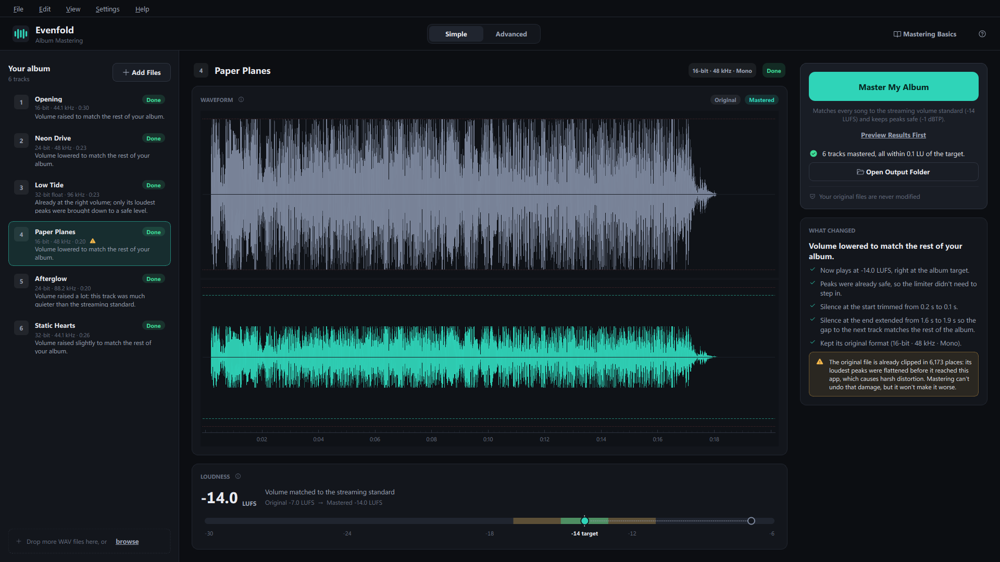
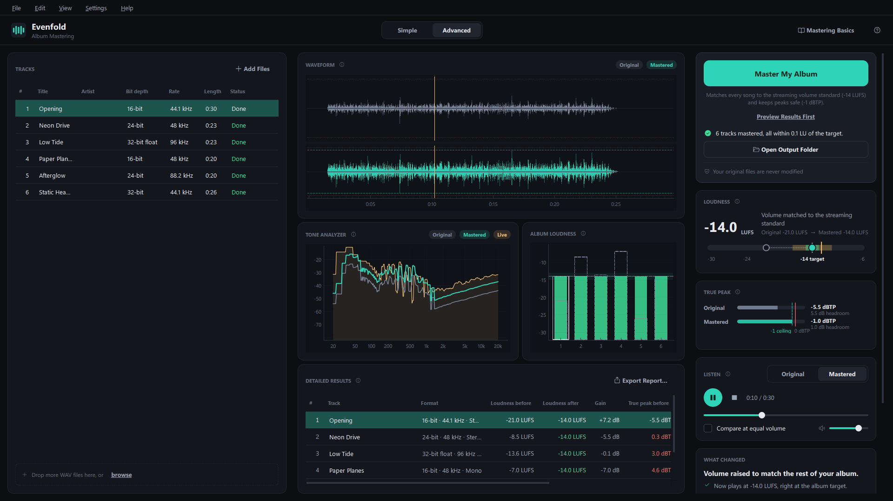

# Evenfold

**Master your whole album in one click.** Evenfold makes every song of an album
play at the same loudness, keeps peaks safe from distortion and evens out the
silence between tracks, so the record sounds like one album instead of a pile of
separate exports. No mastering knowledge needed.



## Download

1. Go to the [**latest release**](../../releases/latest) and download
   `Evenfold-…-windows.zip`.
2. Unzip it anywhere (for example in `Documents`). Keep the whole `Evenfold`
   folder together: `Evenfold.exe` needs the `_internal` folder next to it.
3. Double-click **`Evenfold.exe`**.

Nothing to install, no Python or other software required. Works on Windows 10
and 11 (64-bit).

> **"Windows protected your PC"?** The app isn't code-signed, so Windows
> SmartScreen may warn about it the first time. Click **More info**, then
> **Run anyway**.

## How to use it

1. **Drop your album's WAV files** into the window (or click *Add Files*).
2. Click **Master My Album**.
3. Read what changed for each song, in plain words, then click
   **Open Output Folder**.

The mastered files are saved in a `mastered` folder next to your originals, as
`Song name_mastered.wav`. **Your original files are never modified.**

Not sure yet? Click **Preview Results First**: everything is measured and
processed, but nothing is saved.

## What it does to your songs

| | |
|---|---|
| **Same loudness** | Every track is brought to -14 LUFS, the level Spotify and YouTube play music at (adjustable). |
| **Safe peaks** | A true-peak limiter stops every peak 1 dB below the digital maximum (-1 dBTP), so nothing distorts, even after MP3/AAC conversion. |
| **Even gaps** | Silence at the start and end of each song is evened out, so the album flows with the same pause between tracks. Songs that run straight into the next one are left as they are. |
| **Original formats** | Each file keeps its own bit depth and sample rate (16/24/32-bit, 44.1 to 192 kHz), even when the album mixes them. |
| **Honest warnings** | Files that are already clipped (distorted) are flagged, with an explanation of what that means. |
| **Tone matching** *(optional)* | Gently nudges the bass/mids/treble of each song toward a reference track you pick. |

Everything is explained as you go: hover over any button or setting, or open
**Help › Mastering Basics**.

## Advanced mode

Switch to **Advanced** at the top of the window for the details:

- waveform, tone analyzer and album loudness overview, animated live at your
  screen's refresh rate;
- loudness and true-peak meters, detailed before/after results;
- a player that switches between **Original** and **Mastered** instantly,
  without stopping the music (press **A**), optionally at equal volume;
- editable track titles, artist, album and track numbers, written into the files;
- custom loudness target, peak ceiling, track spacing, one bit depth for every
  file (dithered automatically when reduced), output folder;
- presets to reuse your settings on the next album, and CSV/PDF reports.



## Questions

**Which files can I add?** WAV files: 8, 16, 24 or 32-bit PCM, 32 or 64-bit
float, any sample rate, mono, stereo or surround. Other formats (MP3, FLAC…)
need to be exported to WAV first.

**Why -14 LUFS?** It's the loudness Spotify, YouTube and most streaming
services normalize music to (Apple Music uses -16). Mastering to that level
means your album plays as you intended there. You can pick another target in
Advanced mode.

**The original and mastered versions sound the same.** With *Compare at equal
volume* turned on, both play at the same loudness. When mastering mainly changed
the volume of a song, they then sound nearly identical, which is expected; the
app tells you when that's the case. Turn the option off to hear the change.

**The graphs flicker or stay black.** Turn off **Settings › Hardware
Acceleration**; drawing then uses the processor instead of the graphics card.

**How do I uninstall it?** Delete the `Evenfold` folder. The app also keeps its
preferences in the registry (`HKEY_CURRENT_USER\Software\Evenfold`) and your
saved presets in `%APPDATA%\Evenfold` (and a small icon cache in
`%LOCALAPPDATA%\Evenfold`); delete them too for a clean removal.

## For developers

The app is written in Python (PySide6, pyqtgraph, numpy/scipy, pyloudnorm,
pedalboard, soundfile). Windows builds are made by GitHub Actions
(`.github/workflows/release.yml`):

- every push to `main` builds the app and attaches the zip to the run
  (Actions tab › the run › Artifacts);
- pushing a version tag publishes a release with the zip:
  `git tag v1.0.0` then `git push origin v1.0.0`.

Each build runs the audio tests, then checks the compiled app end to end
(analysis, mastering of a test album, reports; playback too, when the machine
has a sound card).

To build the executable yourself, with Python 3.14 installed:

```powershell
python -m venv .venv
.venv\Scripts\pip install -r requirements.txt
powershell -ExecutionPolicy Bypass -File tools\build_exe.ps1
```

The result is `dist\Evenfold\Evenfold.exe`.

<details>
<summary>How the mastering chain works</summary>

For every file, in parallel:

1. Read the exact sample format, then the audio as 64-bit float.
2. Measure integrated loudness (ITU-R BS.1770-4), 4x-oversampled true peak and
   existing clipping.
3. Optional tone matching: 5-band comparison with the reference track, gentle
   shelf/peak filters (±3 dB at most).
4. Gain to the loudness target.
5. Look-ahead true-peak limiter (always after the gain), with a guaranteed
   ceiling; a little make-up gain is added when limiting pulls the loudness
   below the target.
6. Silence normalisation: a 0.1 s lead-in and matching trailing silence.
7. Write a new WAV in the source's own format, atomically, with title, artist,
   album and track number tags.

The same input and settings always give byte-for-byte identical output.

| Folder | Contents |
|---|---|
| `audio/` | analysis, mastering DSP, batch processing, tags, plain-language summaries |
| `ui/` | interface, theme (`theme.py`, `theme.qss`), all help texts (`tooltips.py`), A/B player |
| `reports/` | CSV and PDF reports |
| `tools/` | executable build: PyInstaller recipe, icon, frozen-build check |
| `tests/` | audio and interface tests, test-album generator |

</details>

## License

The Evenfold source code is released under the [MIT license](LICENSE).

The Windows download also bundles open-source libraries under their own
licenses, all listed in **Help › About**. Two of them, pedalboard (GPLv3) and
mutagen (GPLv2+), are copyleft, so the compiled app as a whole is distributed
under the terms of the GPLv3; its complete source code is this repository.
Qt / PySide6 and fpdf2 are LGPLv3; the others are MIT or BSD.
